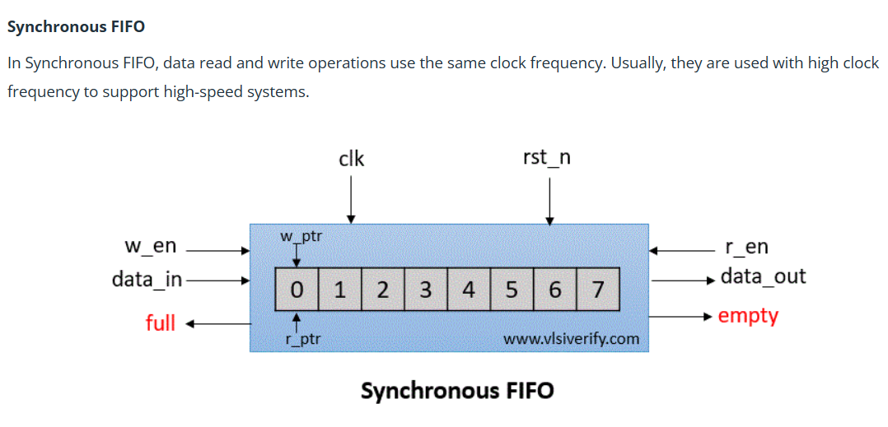
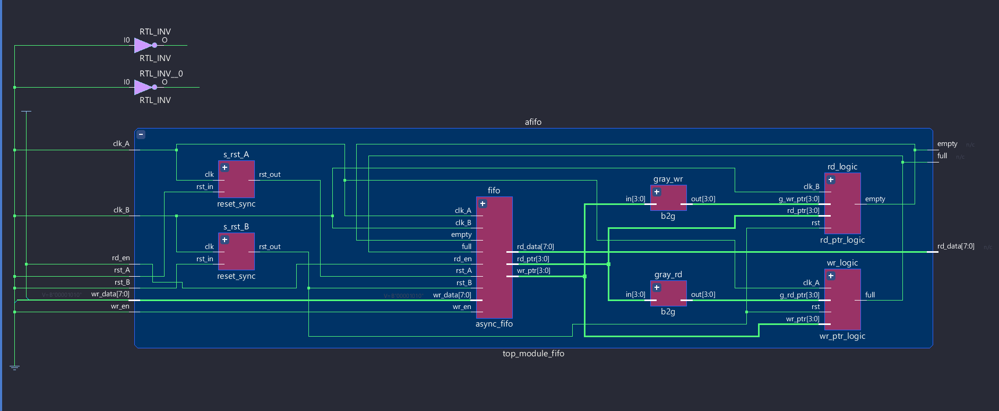
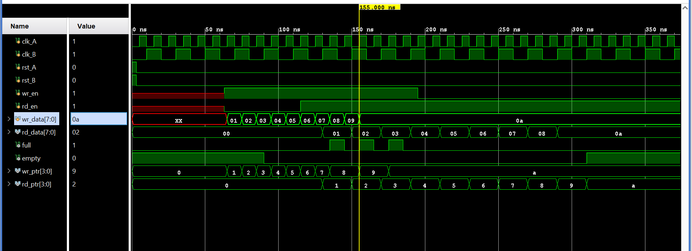
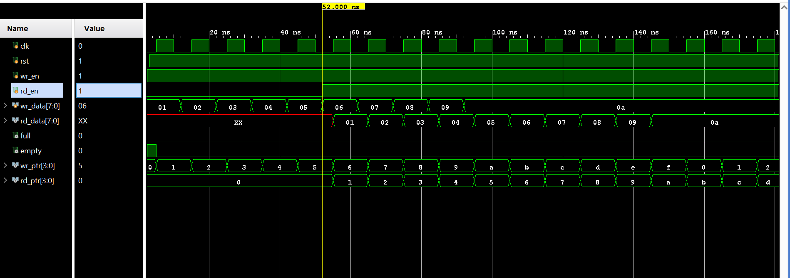

# HDL-Async_and_Sync_FIFO
# Asynchronous & Synchronous FIFO

  

## 📌 Project Overview
This repository contains the RTL implementation of **Synchronous** and **Asynchronous (Multi-Clock)** FIFOs. The design addresses critical digital design challenges including Rate Matching, Clock Domain Crossing (CDC), and Reset Domain Crossing (RDC).

### Architecture
#### Asynchronous FIFO (CDC Safe)
The design utilizes **Gray Code pointers** and **2-stage synchronizers** to safely pass data between independent clock domains ($clk\_A$ and $clk\_B$).

#### Synchronous FIFO
A standard buffered implementation for single-clock domains, useful for latency buffering between modules running at the same frequency.

---
## ⚡ Key Features

### 1. Asynchronous Clock Domain Crossing (CDC)
* **Safe Pointer Passing:** Implemented Binary-to-Gray and Gray-to-Binary conversion to ensure only 1-bit changes during pointer transitions, eliminating glitches when sampling across asynchronous boundaries.
* **2-Stage Synchronization:** Utilizes 2-stage flip-flop synchronizers to mitigate metastability when passing pointers between the Write ($clk\_A$) and Read ($clk\_B$) domains.

### 2. Robust Flow Control & Pessimistic Reporting
* **Flag Generation:** Utilizes $N+1$ bit pointers (MSB used for wrap detection) to generate reliable Full/Empty flags.
* **Pessimistic Safety:** * *Full Flag:* Generated in the Write domain using delayed Read pointers (may assert early, but never late).
    * *Empty Flag:* Generated in the Read domain using delayed Write pointers.
    * **Result:** Guarantees zero data loss (no overflow) and no reading of invalid data (no underflow).

### 3. Reset Domain Crossing (RDC) Safety
* **Reset Bridge:** Implements a "Synchronized Asynchronous Reset" mechanism.
    * *Assertion:* Asynchronous (Immediate response to reset signal).
    * *De-assertion:* Synchronous (Prevents reset recovery violations and metastability on the first clock edge).
---

## 🛠️ Implementation & Synthesis
The design was synthesized in Xilinx Vivado. The schematic below highlights the modular hierarchy, showing the separation of `reset_sync`, `gray_code` converters, and the `fifo` memory array.

---

## 📊 Verification & Waveforms
The designs were verified using self-checking testbenches covering corner cases like saturation, starvation, and pointer rollover.

### 1. Asynchronous FIFO Simulation
* **Scenario:** Data transfer between $clk\_A$ (Fast) and $clk\_B$ (Slow).
* **Observation:** Notice the latency between `wr_en` and the `empty` flag de-assertion due to the synchronization stages.

### 2. Synchronous FIFO Simulation
* **Scenario:** Burst write and read operations.
* **Observation:** Immediate flag updates on the next clock edge.

---

## 📂 File Structure

| Module | Description |
| :--- | :--- |
| `async_fifo_top` | Top-level wrapper instantiating the memory, pointers, and synchronizers. |
| `reset_sync` | RDC logic to safely handle asynchronous resets. |
| `gray_code` | Binary-to-Gray and Gray-to-Binary converters. |
| `ptr_handler` | Logic for empty/full flag generation and pointer increments. |

## 🚀 How to Run
1. Clone the repository.
2. Open the project in **Vivado** or **ModelSim**.
3. Add files from `rtl/` and `tb/`.
4. Run `tb_fifo` for behavioral simulation.
